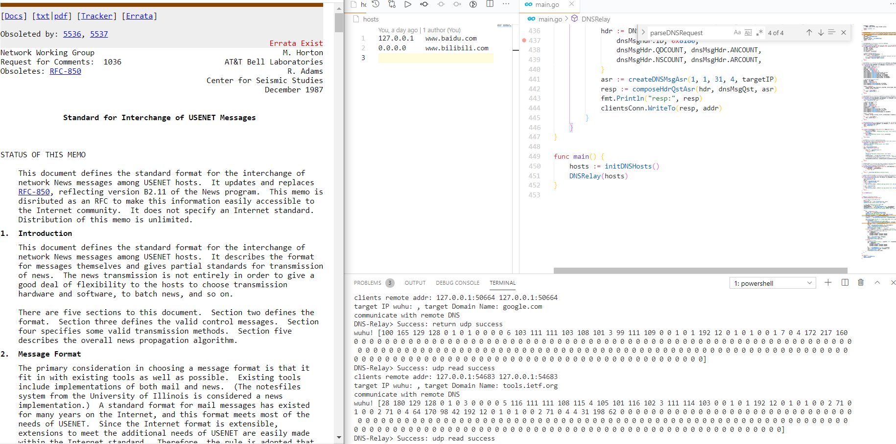

# :earth_asia: DNS-Relay.go

[](https://app.fossa.com/projects/git%2Bgithub.com%2Fskyleaworlder%2FDNS-Relay.go?ref=badge_shield)  [](https://travis-ci.org/skyleaworlder/DNS-Relay.go)

* RFC-1035 / RFC-2535 Learning "Note", a Simple Toy about DNS;
* My First Executable Application Code in Golang;
* My First Socket Programming Experience;

## Usage

Change DNS address on PC:

```bash
// Administrator Mode on Win10-Terminal
C:\User\UserName> netsh
netsh> interface
netsh interface> ipv4
netsh interface ipv4> set dnsserver "WLAN" static 127.0.0.1
```

Execute `main.go`:

```bash
go run main.go
```



PC gets the IP address of tools.ietf.org from localhost:53. "RFC-1036" on the left side is the result of DNS-Relay. It might be slow... But it work at that moment.

## Test

```bash
go test -run ^Test -v github.com/skyleaworlder/DNS-Relay.go
```

## License

[](https://app.fossa.com/projects/git%2Bgithub.com%2Fskyleaworlder%2FDNS-Relay.go?ref=badge_large)
